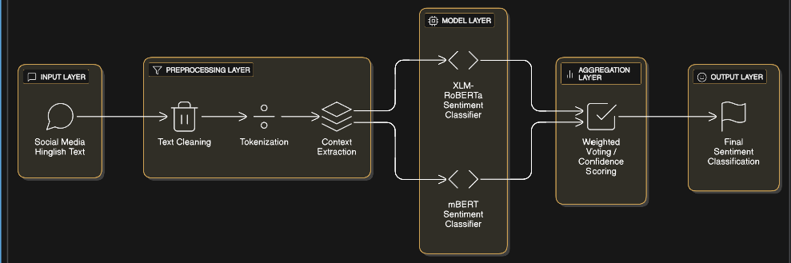
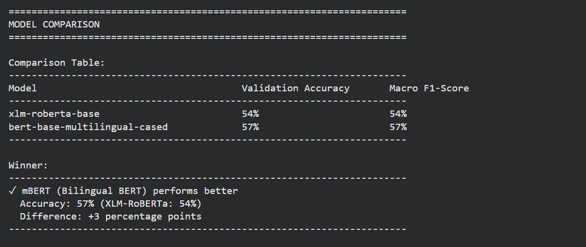
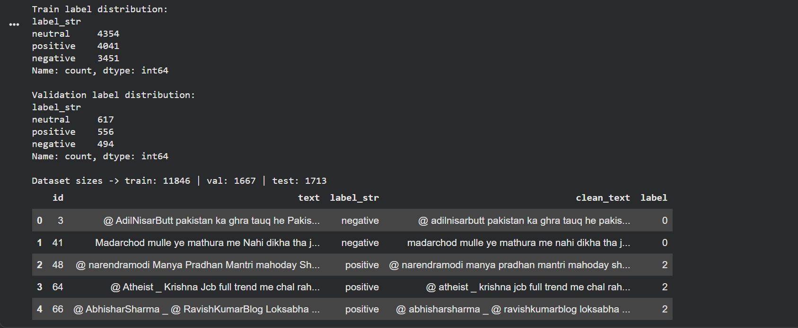

## Run in Google Colab

# SmartSentiment: Hinglish Sentiment Analysis

## Overview
SmartSentiment is a context-aware sentiment analysis system designed for Hindi-English (Hinglish) social media text. It uses transformer-based models to classify text into positive, negative, and neutral sentiments.

---

## Models Used
- XLM-RoBERTa  
- mBERT  

---

## Results
- mBERT Accuracy: 57%  
- XLM-RoBERTa Accuracy: 54%  

---

## Features
- Hinglish text preprocessing  
- Transformer-based classification  
- Multi-class sentiment prediction  

---

## System Architecture

---

## Results Visualization

mBERT performs better than XLM-RoBERTa due to better handling of code-mixed text and multilingual embeddings.

---

## Sample Predictions

---

## Tech Stack
- Python  
- PyTorch  
- HuggingFace Transformers  
- Google Colab  

---

## How to Run
1. Open notebook in Google Colab  
2. Upload dataset (if available)  
3. Run all cells  

---

This system can be used for:
- Social media monitoring
- Brand sentiment analysis
- Public opinion tracking
  
---

## Note
Dataset not included due to size.
